# Getting started

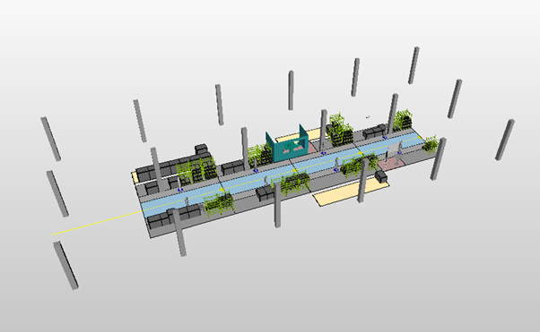

## Load scenario
We use the sprinter demo scenario to get started – first load “sprinter_standard” scenario from the local database “sprinter.ipo”

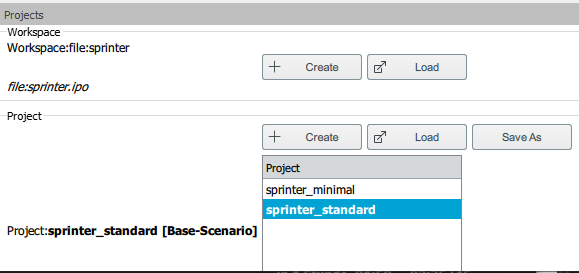

## Set Usd Paths
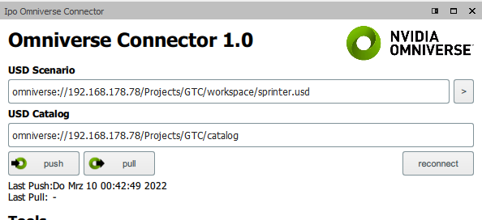

First we set the target USD workspace path

*omniverse://192.168.178.78/Projects/GTC/workspace/sprinter.usd*

Then we set the target catalog path

*omniverse://192.168.178.78/Projects/GTC/catalog*

Setting the target workspace path automatically creates a Linking facility which contains the connection parameters and offset link.

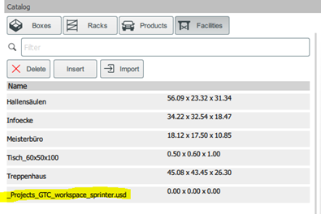

When we’ve set the paths we first export the equipment catalogs

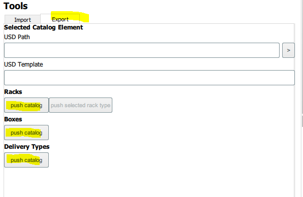

Push all catalogs, racks, boxes and delivery types, in this order.
Now push the scenario with the push button:

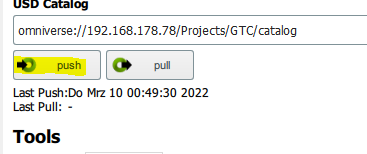

Now we’ve pushed our initial ipolog requirements – you can open it by pressing the “>” button:

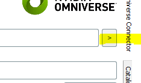

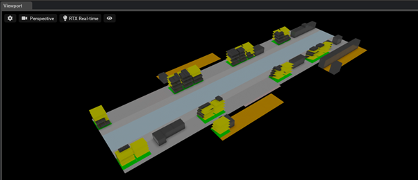

Now we can add nicer geometry to our racks.

Copy the supplied USD “Regal_grn_lang.usd” to the rack catalog in the nucleus – it is advisable to copy those files to a “template” subdirectory

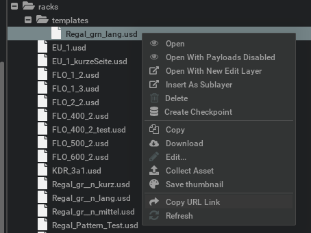

Now copy the template USD Url to the clipboard with “Copy URL Link”
In the ipolog catalog select the “Regal_grün_lang” rack.
In the Export tab of the Omniverse View you can see the USD Path of the generated Requirement USD.

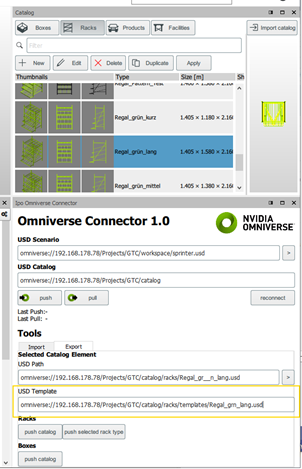

Paste the URL to “USD Template” and click on “push selected rack type”.

Now reload the sprinter.usd file – the ipolog requirement models are hidden and the template USD rack is used instead.

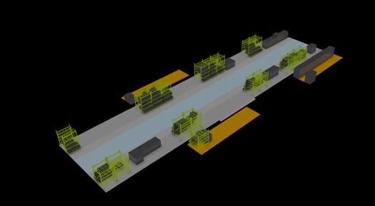

The ipolog requirement model is still there but invisible, you can display it by setting the ipo prim to visible.

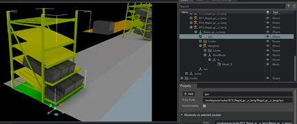

Now lets do the same with boxes

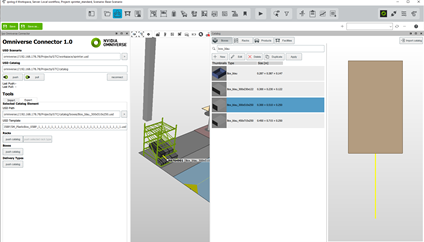

Copy the supplied box templates to your nucleus in catalog/boxes/templates.

Assign the templates to selected box types as described before.

Export the box catalog with “export catalog” in the Export tab of the Omniverse View.

After reload of the sprinter.usd the template USD box geometries are used and scaled correctly.

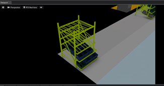

Now lets import a highly detailed item rack

## Import item rack from engineering tool from webwapp into ipolog

create a new rack in ipolog (see ipolog documentation for that)

link the rack to the item engineering tool with this link:

https://item.engineering/DEde/tools/engineeringtool/1aa62b1fe013ec5f83f83c1471c5ec124

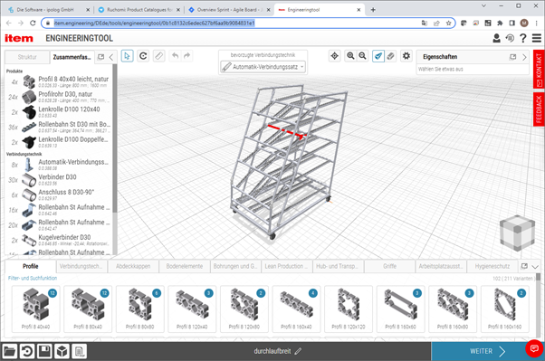

Adjust the shelf meta information accordingly in the ipolog rack editor:

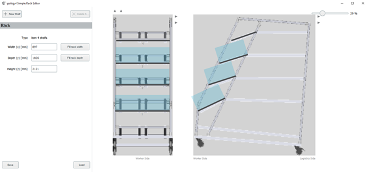

Assign the rack to a material provisioning location:

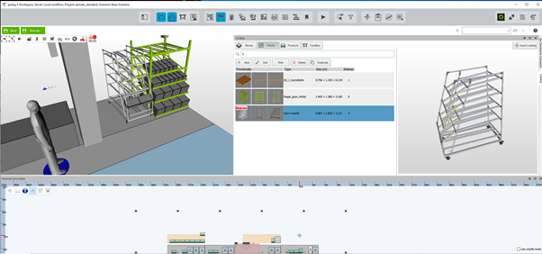

## Import item rack from engineering tool with item extension

Now we’re going to create the same project as highly detailed rack in Omniverse using the synctwin item importer extension.

Activate the extension in KIT:

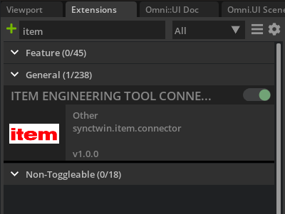

Choose a base-path folder which will contain the imported racks and parts, e.g.
[your nucleus]/ExternalSystems/item

Then paste your project URL in the project url field and press “create usd”, this will import the rack project.
After it has been imported go to the content browser using the “go to content browser” button. Copy the USD path url of the resulting USD.

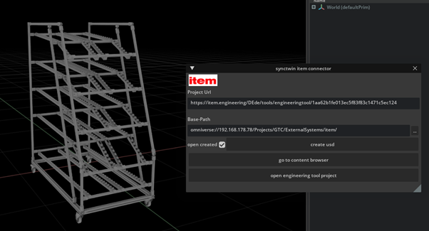

In ipolog select the rack in the catalog and copy the USD path to USD template, then export the rack type with “push selected”

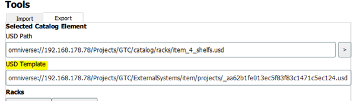

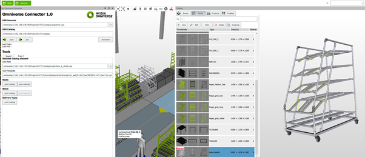

No when we reload the workspace USD we can see the nice new geometry.

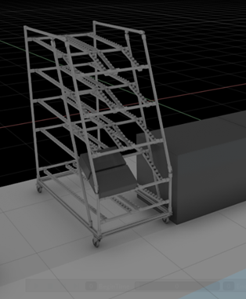

Last not least we can change the materials of the parts to be more realistic.
Open the part folder and assign MDL materials to the single parts

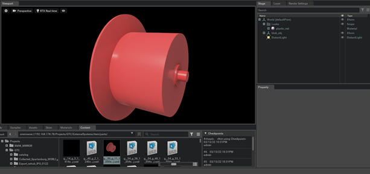

And voila we’ve got a nice looking realistic rack.

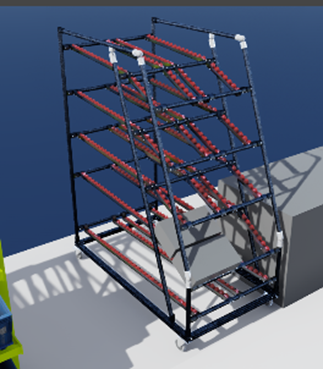
