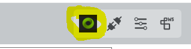
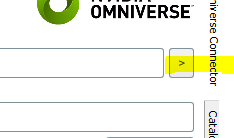

ipolog Omniverse Connector 

Reference Manual 

1.0 

# Omniverse Connector View 

Open the view with this icon in the main menu bar . 

*“USD-Scenario:”*

Path to an USD which will contain our pushed scenario USD 

*“USD-Catalog:”*

Path to a directory which will contain our published equipment catalogs 

*“push”*

Pushes our scenario – note that all catalogs must have been pushed before 

*“pull”*

Pulls areas and rack positions from given scenario USD 

*“live boxes”*

opens a live connection to the boxes layer resulting in immediate changes of the box layer. 

*“reconnect”*

Tries to reestablish connection to the omniverse, also resets the authentication data 
## Tools
Tools are used to push equipment catalogs and import environment geometry from the nucleus.
###
### Import 

**Facility** 

*“create”*

Imports a specified Mesh Prim as a ipolog facility

**Box**

*“import boxgeo”*

Imports a specified Mesh Prim as ipolog box geometry 

*“copy boxgeo”*

Copies USD information of first selected box in the catalog to other selected boxes 

### Export 

**Selected Catalog Element** 

Displays the USD information assigned to the selected catalog element – that works currently for racks, boxes and facilities. 

*“USD Path”*

USD file connected with the ipolog catalog element 

*“USD Template”*

Template USD used in Omniverse 

*“>”* 

Opens the selected USD Path in the assigned KIT application 

**Racks**

*“push catalog“*

Pushes all racks of the catalog to the nucleus 

*“push selected rack type”*

Pushes the selected rack type to the nucleus

**Boxes** 

*“push catalog“*

Export the boxes 

**Delivery Types** 

*“push catalog“*

Export the deliverytypes to the nucleus 

### Using live-boxes mode 
Make sure to select the boxgroup level prim in order to have the box-positions are transmitted correctly. 
###

# Getting started 

## 
## Load scenario 
We use the sprinter demo scenario to get started – first load “sprinter\_standard” scenario from the local database “sprinter.ipo”

## Set Usd Paths 

First we set the target USD workspace path 

*omniverse://192.168.178.78/Projects/GTC/workspace/sprinter.usd*

Then we set the target catalog path 

*omniverse://192.168.178.78/Projects/GTC/catalog*

Setting the target workspace path automatically creates a Linking facility which contains the connection parameters and offset link. 

When we’ve set the paths we first export the equipment catalogs

Push all catalogs, racks, boxes and delivery types, in this order. 

Now push the scenario with the push button: 

Now we’ve pushed our initial ipolog requirements – you can open it by pressing the “>” button: 

Now we can add nicer geometry to our racks 

Copy the supplied USD “Regal\_grn\_lang.usd” to the rack catalog in the nucleus – it is advisable to copy those files to a “template” subdirectory

Now copy the template USD Url to the clipboard with “Copy URL Link”

In the ipolog catalog select the “Regal\_grün\_lang” rack. 

In the Export tab of the Omniverse View you can see the USD Path of the generated Requirement USD. 

Paste the URL to “USD Template” and click on “push selected rack type”

Now reload the sprinter.usd file – the ipolog requirement models are hidden and the template USD rack is used instead. 

The ipolog requirement model is still there but invisible, you can display it by setting the ipo prim to visible. 

Now lets do the same with boxes 

Copy the supplied box templates to your nucleus in catalog/boxes/templates

Assign the templates to selected box types as described before.

Export the box catalog with “export catalog” in the Export tab of the Omniverse View. 

After reload of the sprinter.usd the template USD box geometries are used and scaled correctly. 

Now lets import a highly detailed item rack 

## Import item rack from engineering tool from webwapp into ipolog 
create a new rack in ipolog (see ipolog documentation for that) 

link the rack to the item engineering tool with this link: 

<https://item.engineering/DEde/tools/engineeringtool/1aa62b1fe013ec5f83f83c1471c5ec124>

Adjust the shelf meta information accordingly in the ipolog rack editor:

Assign the rack to a material provisioning location: 

## Import item rack from engineering tool with item extension 

Now we’re going to create the same project as highly detailed rack in Omniverse using the synctwin item importer extension. 

Activate the extension in KIT: 

Choose a base-path folder which will contain the imported racks and parts, e.g. 

[your nucleus]/ExternalSystems/item 

Then paste your project URL in the project url field and press “create usd”, this will import the rack project. 

After it has been imported go to the content browser using the “go to content browser” button. Copy the USD path url of the resulting USD. 

In ipolog select the rack in the catalog and copy the USD path to USD template, then export the rack type with “push selected”

No when we reload the workspace USD we can see the nice new geometry. 

Last not least we can change the materials of the parts to be more realistic.

Open the part folder and assign MDL materials to the single parts 

And voila we’ve got a nice looking realistic rack. 

Companion KIT Extensions 

Reference Manual 

1.0 

# ipolog Selection Info 
The ipolog selection info extension displays ipolog metadata attributes of a selected prim.

Usage: Select an “ipo” prim, attached meta information will be displayed in the extension widget. 

Get it from here: <https://github.com/mtw75/ipo_selectionview/archive/refs/heads/master.zip>

# synctwin item engineering tool importer 

Imports highly detailed CAD data from item engineering tool webapp into an USD file 

Get it from here: [https://github.com/mtw75/item_extension/archive/refs/heads/master.zip]( )

*“Project Url“*

Url of the construction project 

*“Base-Path”*

Base path for imported USD files, there are two subdirectories: 

[base path]/projects  - contains result rack project files – reference these into your scenario

[base path]/parts – parts used in project racks are referenced in the project rack files 

*“create usd”*

creates a USD from given project Url. 

*“open created”*

If this is checked the created USD file is opened after creation.

*“go to content browser”*

finds the resulting USD in the content browser 

*“open engineering tool project”*

Opens project in engineering tool web app

# Ipolog MetaData in USD elements 
## General 
ipo\_type 

ipo\_id 

## Areas

## Boxes 

## DeliveryTypes

## Racks 
