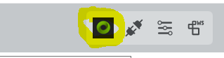
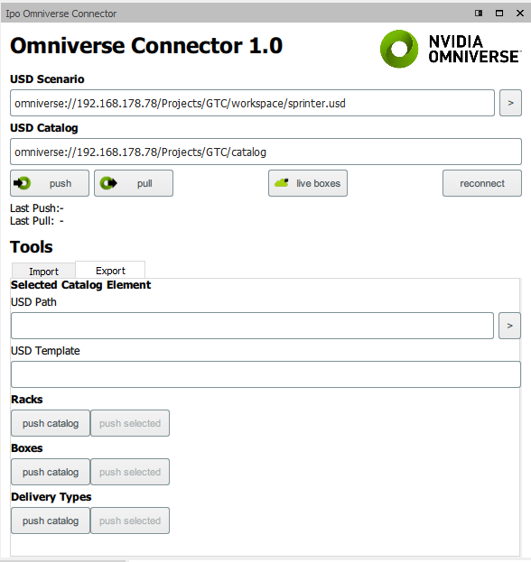
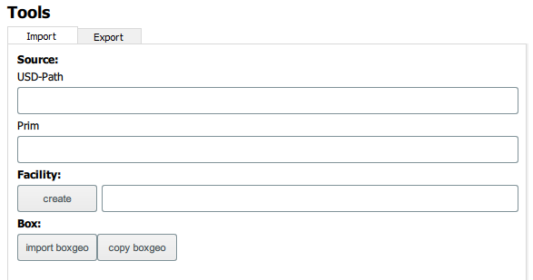
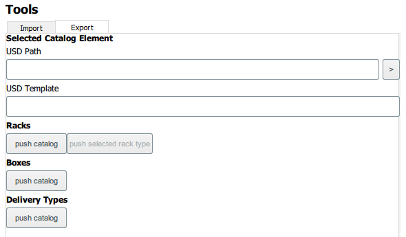
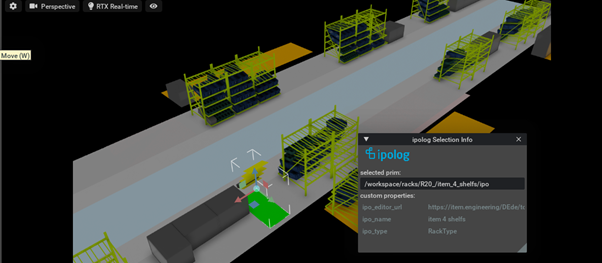
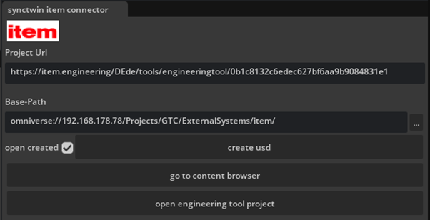

#ipolog Omniverse Connector
Reference Manual v1.0

see [Getting Started](./GettingStarted.md)

##Omniverse Connector View

Open the view with this icon in the main menu bar.

### Main Bar

| Element            | Description |
|--------------------|--------|
| *“USD-Scenario”*   |  Path to an USD which will contain our pushed scenario USD   |
| *“USD-Catalog”*| Path to a directory which will contain our published equipment catalogs |
| *“push”*| Pushes our scenario – note that all catalogs must have been pushed before |
| *“pull”* | Pulls areas and rack positions from given scenario USD |
| *“live boxes”* | opens a live connection to the boxes layer resulting in immediate changes of the box layer. |
| *“reconnect”* | Tries to reestablish connection to the omniverse, also resets the authentication data |

### Tools
Tools are used to push equipment catalogs and import environment geometry from the nucleus.

#### Import Tab

| Section | Element            | Description |
|---------|-----------|--------|
| **Facility** | *“create”* | Imports a specified Mesh Prim as a ipolog facility |
| **Box**      | *“import boxgeo”* | Imports a specified Mesh Prim as ipolog box geometry |
|          | *“copy boxgeo”* | Copies USD information of first selected box in the catalog to other selected boxes

#### Export Tab

| Section | Element            | Description |
|---------|-----------|--------|
| **Selected Catalog Element** || Displays the USD information assigned to the selected catalog element – that works currently for racks, boxes and facilities. |
| | *“USD Path”* | USD file connected with the ipolog catalog element |
| | *“>”*  | Opens the selected USD Path in the assigned KIT application
| | *“USD Template”* | Template USD used in Omniverse
| **Racks** | *“push catalog“* |Pushes all racks of the catalog to the nucleus |
| | *“push selected rack type”* | Pushes the selected rack type to the nucleus
| **Boxes** | *“push catalog“* | Export the boxes
| | *“push selected box type”* | Pushes the selected box type to the nucleus
| **Delivery Types** | *“push catalog“* | Export the deliverytypes to the nucleus

## Remarks

#### Using live-boxes mode
Make sure to select the boxgroup level prim in order to have the box-positions are transmitted correctly.

# Companion KIT Extensions

## ipolog Selection Info

The ipolog selection info extension displays ipolog metadata attributes of a selected prim.

Usage: Select an “ipo” prim, attached meta information will be displayed in the extension widget.
Get it from here: https://github.com/mtw75/ipo_selectionview/archive/refs/heads/master.zip

## synctwin item engineering tool importer

Imports highly detailed CAD data from item engineering tool webapp into an USD file
Get it from here: https://github.com/mtw75/item_extension/archive/refs/heads/master.zip

| Element            | Description |
|--------------------|--------|
| *“Project Url“* | url of the construction project |
| *“Base-Path”* | base path for imported USD files, there are two subdirectories: |
| |  [base path]/projects  - contains result rack project files – reference these into your scenario |
| |  [base path]/parts – parts used in project racks are referenced in the project rack files  |
| *“create usd”* | creates a USD from given project Url.  |
| *“open created”* | If this is checked the created USD file is opened after creation.|
| *“go to content browser”* | finds the resulting USD in the content browser |
| *“open engineering tool project”* | opens project in engineering tool web app|
